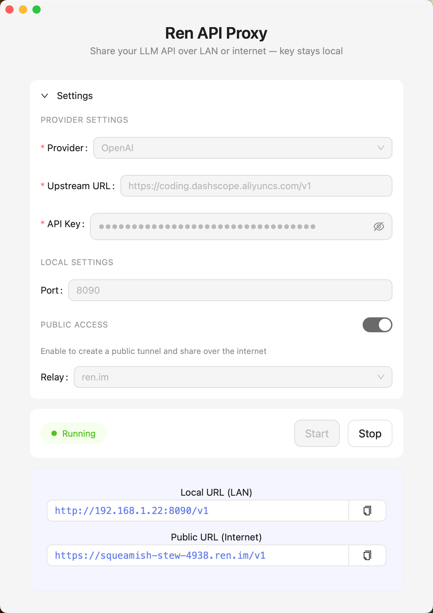

<p align="center">
  <a href="../LICENSE"></a>
</p>

<p align="center">
  <a href="../README.md">English</a> | <strong>中文</strong>
</p>

# Ren AI Proxy

一款支持局域网及公网共享的 AI 配额代理工具。无需分发 API Key 即可安全调用 LLM 资源，有效杜绝密钥泄露风险。

<p align="center">
  
</p>

## 功能特性

- 在网络上与他人共享你的 OpenAI/Anthropic/Ollama API
- 你的 API 密钥永远不会离开你的设备
- 简单一键式设置
- 兼容任何 OpenAI 协议的客户端
- **公共访问**：创建公共隧道来在互联网上共享你的代理——你的 API 密钥始终保留在你的机器上

## 安装

### 从源码构建

```bash
cd ren
npm install
npm run tauri build
```

构建后的应用程序位于 `src-tauri/target/release/bundle/`。

### 预编译版本

从 [发布页面](https://github.com/junyiz/ren/releases) 下载。


> 初次运行说明：macOS 会拦截从互联网下载的未签名应用。将 Ren AI Proxy.app 拖入“应用程序”文件夹后，请打开终端 (Terminal) 并运行：
> 
> ```bash
> xattr -cr /Applications/Ren\ AI\ Proxy.app/
> ```


## 使用方法

1. 下载并安装 Ren AI Proxy
2. 在文本框中输入你的 API 密钥
3. 选择你的提供商（OpenAI、Anthropic 或 Ollama）
4. 点击"启动服务"
5. 与网络上的其他人分享显示的 URL

### 公共访问（互联网）

启用"公共访问"可通过 tunelo 中继创建公共隧道。你的 API 密钥保留在本地机器上，永远不会与中继服务共享。

## 连接到你代理的用户

将客户端的 `base_url` 设置为应用显示的 URL：

```python
from openai import AsyncOpenAI

client = AsyncOpenAI(
    base_url="http://192.168.1.x:8090/v1",  # 使用应用中的 URL
    api_key="anything"  # 可以是任意值，不会被使用
)
```

```bash
curl -s https://stupendous-division-5473.ren.im/v1/chat/completions \
    -H "Content-Type: application/json" \
    -d '{
      "model": "kimi-k2.5",
      "messages": [{"role": "user", "content": "hi"}]
    }'
```

## 安全

你的 API 密钥在本地加密，永远不会离开你的设备。代理仅在客户端和 LLM 提供商之间转发请求。

## 开发

```bash
# 安装依赖
npm install

# 开发模式运行
npm run tauri dev

# 生产环境构建
npm run tauri build
```

## 致谢
[tunelo](https://tunelo.net) · [plano](https://github.com/katanemo/plano)
